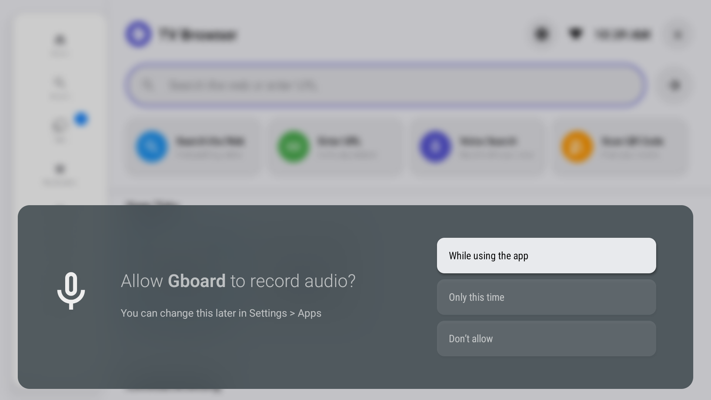
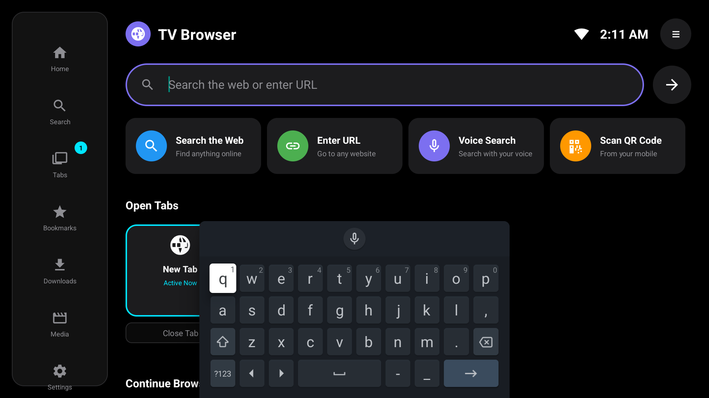
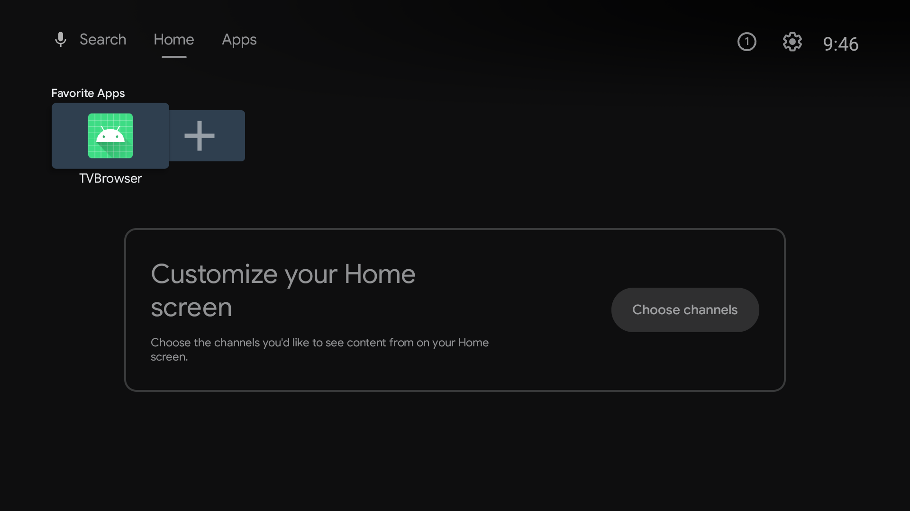
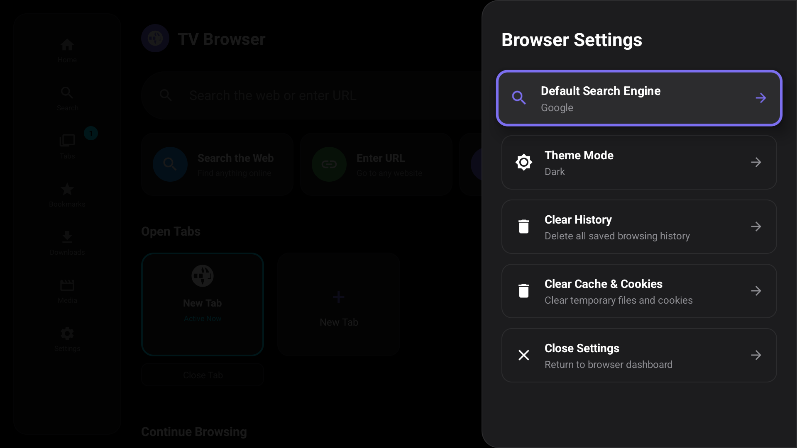

# Android TV Browser

An Android-based web browser optimized for Android TV and D-pad remote controller navigation.

## Downloads

Deployable package installation files:
* [Download Release APK (Optimized)](apks/app-release.apk)
* [Download Debug APK (Testing Symbols)](apks/app-debug.apk)

## Features

### D-pad Remote Control Optimization
* Solid virtual cursor with accent glow indicators.
* Thick 3dp outline highlights when views receive focus.
* Scaled zoom card animation (1.08x) for clear visual feedback.

### Right-Sliding Settings Panel Drawer
* Settings slide in from the right edge with clean decelerating animation.
* Preferences grouped into rows featuring vector icons and value descriptions.

### Redesigned Search Engine Selector
* Picker dialog displays choices as interactive list rows.
* Features search icons, engine titles, and circle selected dots.

### Visual Themes
* Dark Mode: True Black (#000000) for OLED screen compatibility.
* Light Mode: Apple-inspired Light Grey (#F2F2F7) background with premium ambient shadows.

## User Interface Screenshots

### Light Mode Home Dashboard

### Dark Mode Home Dashboard

### Redesigned Search Engine Picker

### Right-Sliding Settings Panel

